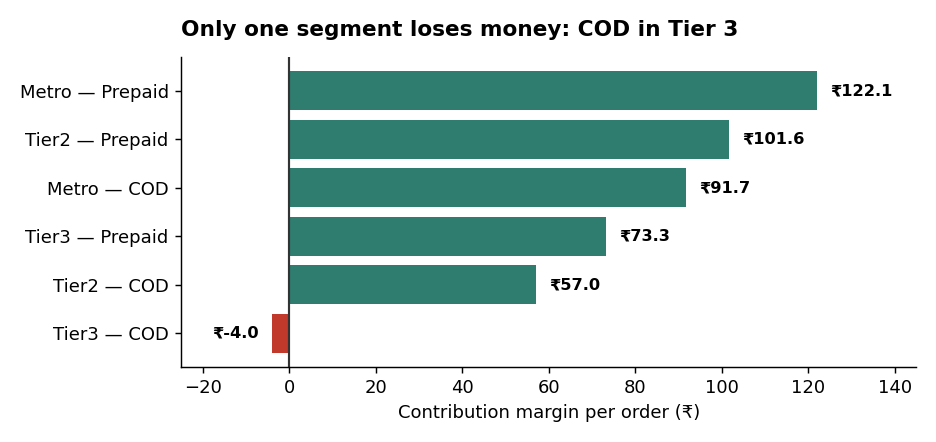
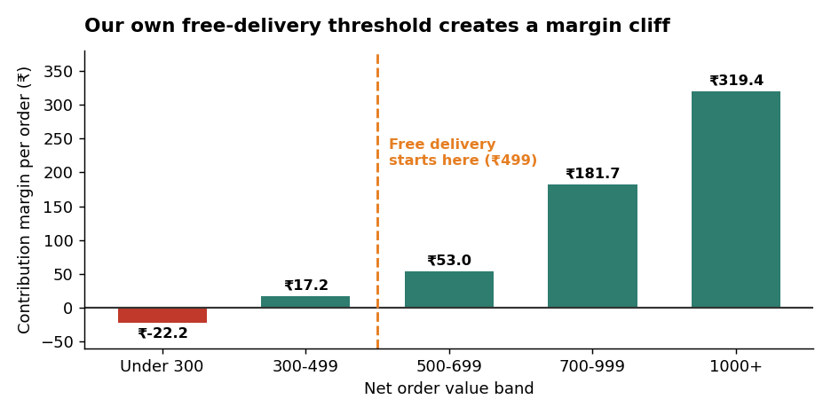
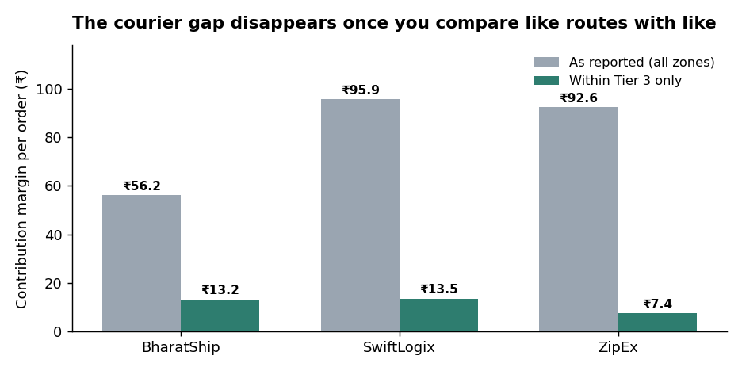
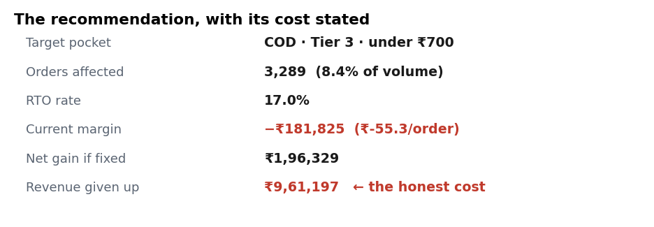

# Where is our order margin leaking?

BrightBasket is a D2C brand selling personal care and home products across 15 Indian cities.
Orders went up 30% in a year. Profit stayed flat.

I looked into why. The answer was that 28% of orders were losing money, and most of the loss
was hiding in one small group of orders nobody had looked at separately.

I found two policy changes worth about **₹5.7 lakh a year**. I also found two things that
looked like problems but weren't, and I recommend leaving those alone.

---

## The question I was trying to answer

Which orders lose us money, and what is the one change that fixes the most of it without
killing sales?

There were three obvious options on the table:

| Option | My answer | Reason |
|---|---|---|
| Stop offering Cash on Delivery | Only in tier-3 cities | COD makes ₹92 per order in metros. Banning it everywhere would throw away ₹9L of good profit to fix an ₹18k problem. |
| Raise the free-delivery limit | Yes, ₹499 to ₹699 | Right now we give free shipping to orders that can't cover the shipping cost. |
| Change courier partner | No | The courier that looks worst isn't worse. It just gets the harder routes. |

---

## What I found

### 1. The leak is ₹11.5 lakh a year

11,169 out of 39,355 orders lose money. That's 28.4% of all orders.

The overall margin looks fine at 15%. That's because the profitable orders cover for the
loss-making ones. Once you separate them, the losses come to 26% of everything the good orders
earn.

### 2. Only one group of orders actually loses money

| Zone | Payment | Orders | RTO rate | Profit per order |
|---|---|---:|---:|---:|
| Tier 3 | COD | 4,611 | 16.3% | −₹4.0 |
| Tier 2 | COD | 7,916 | 10.4% | ₹57.0 |
| Tier 3 | Prepaid | 1,249 | 2.2% | ₹73.3 |
| Metro | COD | 9,888 | 8.1% | ₹91.7 |
| Tier 2 | Prepaid | 3,994 | 2.1% | ₹101.6 |
| Metro | Prepaid | 11,697 | 1.8% | ₹122.1 |

Five of six groups make money. Only COD in tier-3 cities is negative.

### 3. "COD is the problem" is the wrong conclusion

If you only look at payment mode, COD earns ₹59.8 per order and prepaid earns ₹113.7. It looks
obvious: stop offering COD.

But COD isn't spread evenly. It's 46% of orders in metros and 79% in tier-3 cities, because
fewer people there pay online. So "COD orders" and "tier-3 orders" are partly the same orders
with two different labels.

When I compared COD and prepaid inside each zone separately, COD in metros still earned ₹91.7
per order. That's a good order. The problem is COD *and* tier 3 together, not COD by itself.

If I had gone with the first answer, the company would have blocked thousands of profitable
metro orders for nothing.

### 4. The courier that looks worst is fine

BharatShip earns ₹56.2 per order. SwiftLogix earns ₹95.9. Looks like a bad partner.

But BharatShip runs 38.5% of its deliveries in tier-3 cities. SwiftLogix runs 3.5%. Tier-3
delivery is expensive for everyone.

When I compared them only within tier 3, BharatShip was ₹13.2 and SwiftLogix was ₹13.5. Almost
identical. So there's no courier problem here. **I recommend doing nothing about couriers.**

### 5. Our own free-delivery rule is costing us

We give free delivery above ₹499.

| Order value | Orders | Fee we charge | Shipping cost | Profit per order |
|---|---:|---:|---:|---:|
| Under ₹300 | 4,947 | ₹44 | ₹87 | −₹22.2 |
| ₹300–499 | 11,192 | ₹44 | ₹87 | ₹17.2 |
| ₹500–699 | 11,307 | ₹0 | ₹86 | ₹53.0 |
| ₹700–999 | 8,855 | ₹0 | ₹85 | ₹181.7 |
| ₹1,000+ | 3,054 | ₹0 | ₹86 | ₹319.4 |

Look at the jump between ₹500–699 and ₹700–999. Profit goes from ₹53 to ₹182 for orders that are
barely different in size. That's not customer behaviour, that's our own rule. We're giving ₹86 of
free shipping to orders that only carry about ₹140 of margin.

Also, orders under ₹300 lose ₹22 each. We charge ₹49 for delivery and it costs us ₹87. That fee
hasn't been updated in a long time.

---

## What I recommend

**1. Ask for prepaid on COD orders under ₹700 in tier-3 pincodes.**

This covers 3,289 orders, about 8.4% of all orders. They have a 17% return rate and lose ₹55.3
each.

- Losses we stop making: ₹1,81,825
- Extra profit from customers who switch to prepaid: ₹14,504 (assuming 35% switch)
- **Total gain: ₹1,96,329**

We would lose about ₹9.6 lakh of sales from customers who just don't buy. That sales was losing
money, so profit still goes up. But if the company cares more about sales growth than profit
right now, that's a call for management, not for me.

**2. Raise the free-delivery limit from ₹499 to ₹699.**

10,176 orders would start paying the ₹49 fee. If 75% of them still buy, that's **₹3,73,968**.

**Together: ₹5,70,297 a year. That's 17.5% more profit, from two rule changes and no spending.**

One thing worth pointing out about recommendation 1: the ₹1,81,825 of avoided losses happens
whether or not anyone switches to prepaid. So even if my 35% guess is completely wrong and
nobody switches, the change still makes money.

---

## The dashboard

**[`dashboard/BrightBasketDashboard.xlsx`](dashboard/BrightBasketDashboard.xlsx)**

An Excel workbook. All the KPIs and charts use live SUMIFS and AVERAGEIFS formulas over all
39,355 rows, so nothing is a typed-in number. Change a filter and everything updates.

| Sheet | What it has |
|---|---|
| Dashboard | KPIs and three charts, with two dropdown filters |
| Pivot | A PivotTable with slicers — add it yourself in 3 steps, see the Read Me sheet |
| Segment Analysis | The three main breakdowns |
| Scenario Model | Assumptions you can change, plus a sensitivity table |
| Data Quality | Every data problem I found and what I did about it |
| Order Data | All the cleaned rows |

Charts from `scripts/make_charts.py`:






Why I picked each chart type: [`dashboard/README.md`](dashboard/README.md).

---

## Why I used contribution margin

Contribution margin means: revenue minus every cost that only happens because this order
happened.

I didn't use gross margin, because gross margin is just revenue minus product cost. Shipping and
returns sit below that line, so every order in this data looks healthy on gross margin. It would
have hidden the whole problem.

I didn't use net profit either, because that needs fixed costs like salaries and rent. Those
don't change when one more order comes in. To split rent across orders I'd have to invent a rule,
and I couldn't defend whatever rule I picked.

The question here is "should we keep taking orders like this one?" For that question, only the
costs that appear and disappear with the order matter.

```
contribution margin = revenue collected
                    + delivery fee collected
                    − product cost      (full if delivered, 15% written off if returned)
                    − shipping cost     (both ways if the order comes back)
                    − payment cost      (2% gateway on prepaid, ₹25 flat on COD)
```

A returned order is worse than no order at all. We pay to ship it out, pay again to get it back,
and collect nothing. That's roughly ₹219 lost on an order that would have made ₹139.

I wrote this formula once, in a SQL view, so the dashboard and the analysis can't drift apart.

---

## Cleaning the data

I counted every problem before fixing it, so anyone can check what I did.

| Problem | Rows | What I did | Why |
|---|---:|---|---|
| Same order_id twice | 180 | Kept the first | One row should mean one order. Duplicates inflate both sales and costs. |
| No pincode | 602 | Removed them | I need the zone. Without it I can't put the order in any group. |
| Two different date formats | 900 | Read each row properly | The easy option would have quietly turned 900 real dates into blanks. |
| Negative discount | 120 | Made them positive | A discount can't be negative. Someone had entered a refund in the wrong column. |
| Orders worth ₹0 | 45 | Removed | All from `INTERNAL_QA`. They're test orders, not real sales. |
| Shipping charged on cancelled orders | 140 | Set to zero | We never shipped them. The courier billed us by mistake, which is worth telling the ops team about. |
| City names in different cases | 121 | Made them consistent | "Bengaluru", "BENGALURU" and "bengaluru" would show up as three separate cities. |

Before removing the 602 rows with no pincode, I checked whether they looked different from the
rest. They were 53% COD; the rows I kept were 57% COD. Close enough that removing them doesn't
change the answer. If they had been 90% COD I would have had to do something else, because I'd be
deleting exactly the orders I was investigating.

**39,355 rows kept out of 40,180.**

---

## What's in this repo

```
brightbasket-margin-leak/
├── README.md
├── SETUP.md                         how to run it
├── data/
│   ├── raw/                         the messy starting data
│   ├── processed/                   cleaned data, feeds the dashboard
│   └── brightbasket.db              SQLite database
├── scripts/
│   ├── generate_raw_data.py         makes the dataset
│   ├── build_database.py            loads it into SQLite
│   ├── analysis.py                  the full analysis
│   ├── make_charts.py               the chart images
│   └── make_excel_dashboard.py      builds the Excel file
├── sql/
│   ├── 01_data_quality_checks.sql   checks I ran before cleaning
│   ├── 02_order_economics_view.sql  the margin formula
│   ├── 03_leak_size_and_location.sql
│   ├── 04_confounder_checks.sql     the two queries that changed my answer
│   └── 05_threshold_and_scenario.sql
├── notebooks/
├── dashboard/
└── docs/
    ├── ASSUMPTIONS.md               every number I assumed
    ├── AI_USAGE.md                  how I used AI

``

To run it yourself, see [SETUP.md](SETUP.md).

---

## Tools

Excel (PivotTables, slicers, SUMIFS/AVERAGEIFS, scenario modelling) · SQL (SQLite) ·
Python (pandas, numpy) · Git

---

## How I used AI

I used Claude while building this. I've written up the details in
[docs/AI_USAGE.md](docs/AI_USAGE.md), but the short version:

I used it for writing code faster, and for arguing against me when I thought I'd found something.
That second one is how I caught the courier mistake. My first conclusion was that BharatShip was
underperforming. When I asked for the case against that, the reply was "what else is different
between these couriers?" — which led me to check the route mix and change my answer completely.

I decided the question, the metric, the assumptions, and the recommendations. I checked the work
by writing the analysis twice, once in SQL and once in pandas, and comparing. That's how I found a
real bug in my own code — I was grouping orders by revenue instead of by order value, which pushed
every returned order into the "under ₹300" bucket, because returned orders have zero revenue.

---

## What this project doesn't cover

**The data is made up.** No company publishes order-level product cost, shipping cost and return
data together. That's their actual unit economics and it's confidential. So I wrote a generator
instead, and left it open in `scripts/generate_raw_data.py` with every assumption written down in
`docs/ASSUMPTIONS.md`. This means the findings aren't a discovery about a real company. What it
shows is the method.

**The 35% prepaid switch rate is a guess.** A proper answer would be a two-week test on five
tier-3 pincodes. That's what I'd suggest doing before rolling this out.

**Only one year of data,** so I can't say anything about seasonality or whether returns are getting
worse.

**No repeat-customer view.** A tier-3 COD customer we block today might have come back and become
profitable later. My analysis is order by order, so I can't see that. It's a real gap, not a small
one.
